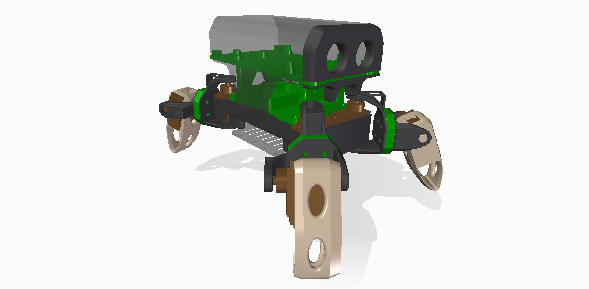
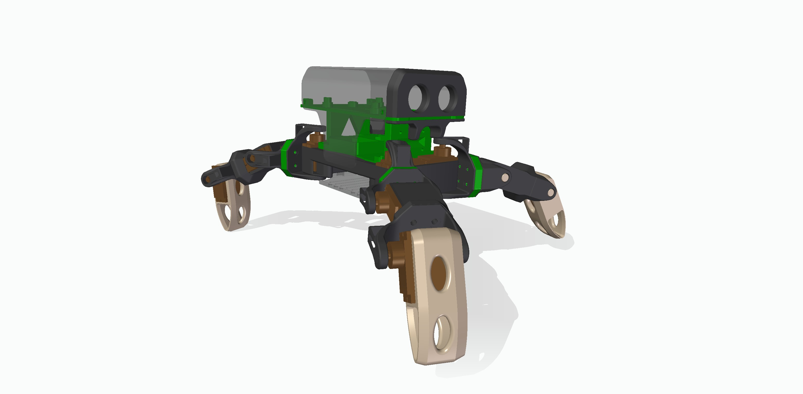
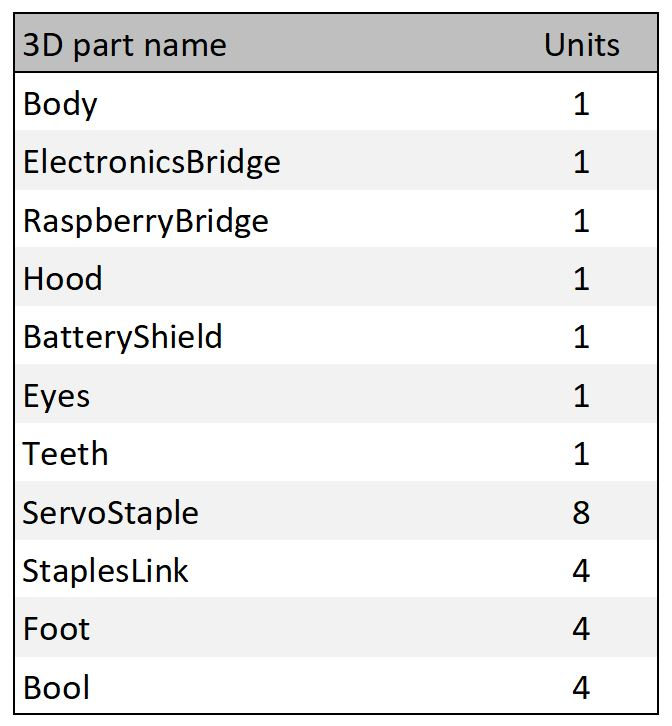
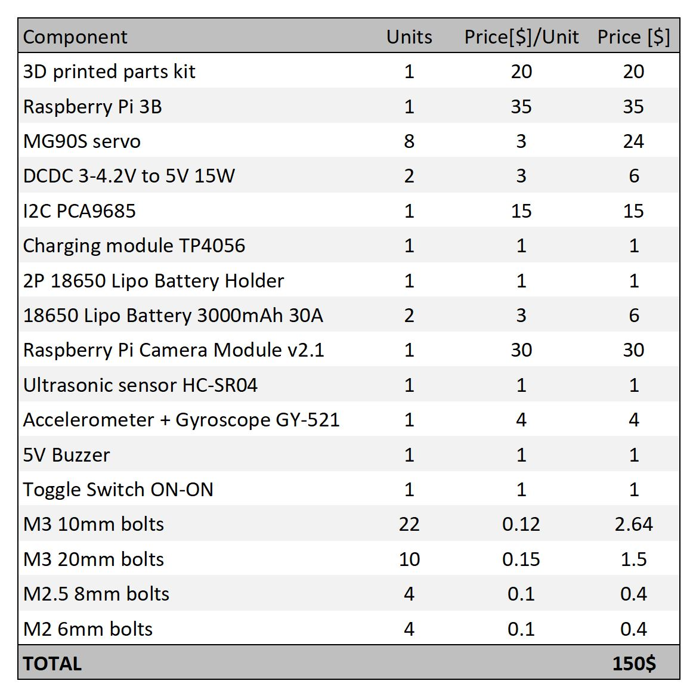

# LoCoQuad Robot

**Authors:** [Manuel Bernal] & [Javier Civera]

LoCoQuad is an Open Source, LowCost four legged Robot based on the Raspberry Pi platform. 
It has arise as response of the necesity of cheap robotic platforms orientated to the development of IA, ML and RL algorithims.

LoCoQuad is the first final version of a series of prototipes, the LoCoQuad's family. They all had 4 legs, and they can handle two or three joints per leg, giving a range of personalization from 8 to 12 servo motors controlling the movement of this little quadruped. Designed in the spider mode, it has a very low price (150 USD) and brings lots of development oportunities.
##Two Joints Configuration:


##Three Joints Configuration:


# 1. License
LoCoQuad Software is released under a [GPLv3 license](https://https://github.com/TomBlackroad/LoCoQuad/blob/master/LICENSE).

For a closed-source version of LoCoQuad for commercial purposes, please contact the authors: mbernallecina (at) gmail (dot) com.

# 2. Prerequisites
We have tested the code in **Raspbian Buster Lite**, but it should be easy to compile in other platforms. The board installed in the robot is a Raspberry Pi 3 Model B, also B+ was tested with same results.

In order to use the code, a LoCoQuad Robot would be needed. You can build it yourself the ".stl" designs from this repository () and the components from Section 4.

Very soon LoCoQuad would be availble online! 

# 3. Building your own LoCoQuad Robot

Build your own LoCoQuad Robot (You can follow this instructions: thingeverse.com and this tutorial: youtube.com )

Once ready, burn your 32 GB SD card whith the following image: link to repository...

Clone the repository in your Raspberry:
```
git clone https://github.com/TomBlackroad/LoCoQuad.git
```
Calibrate all the servos... VIDEO


TODO...

# 4. Components and Costs

## List of 3D parts needed
<p align="center">
   
</p>

## Overall LoCoQuad Costs
<p align="center">
  
</p>

# 5. Future Versions

## OpenCV
OpenCV is not used in this first version, nevertheless we are working to bring new functionalities based on this librery.

## ROS (optional)
Currently testing the code into the ROS structure, new version would have all the ROS capabilities ready to use. 

# 6. Comments

## Other Designs
If you require specific designs for other research projects that you want us to discuss please contact mbernallecina (at) gmail (dot) com and leave your contact details.
